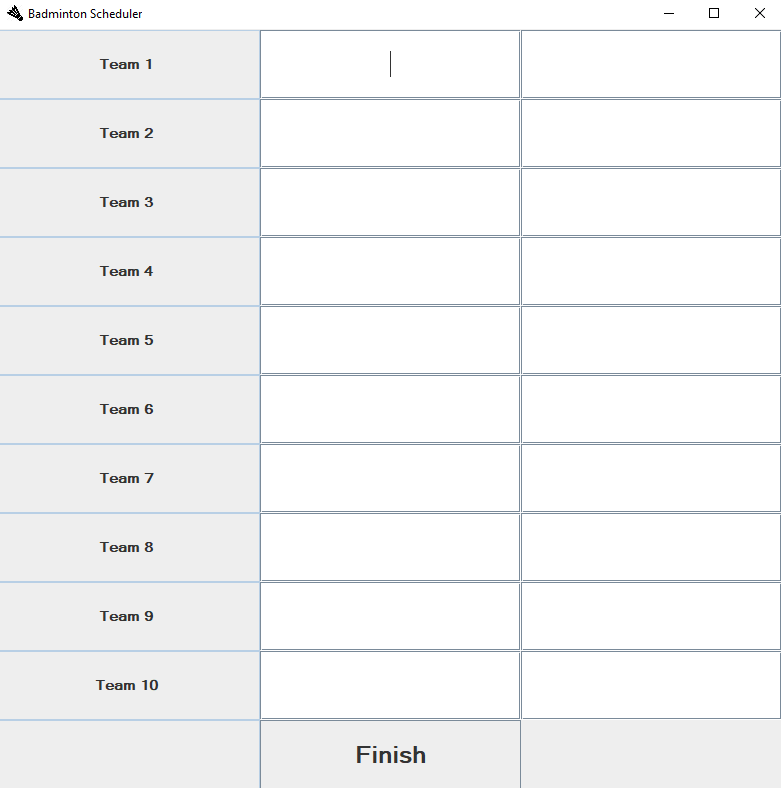
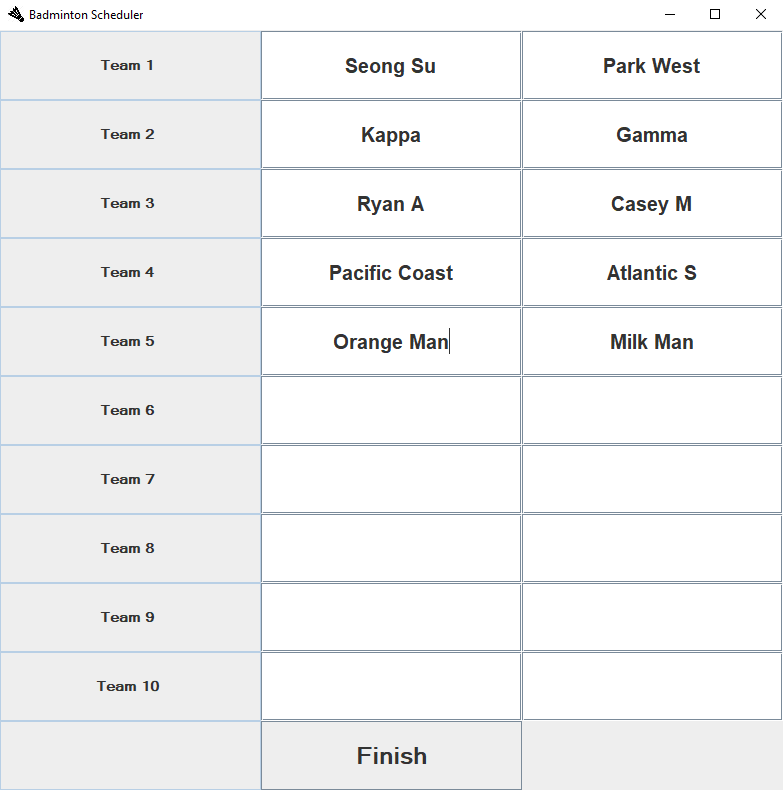
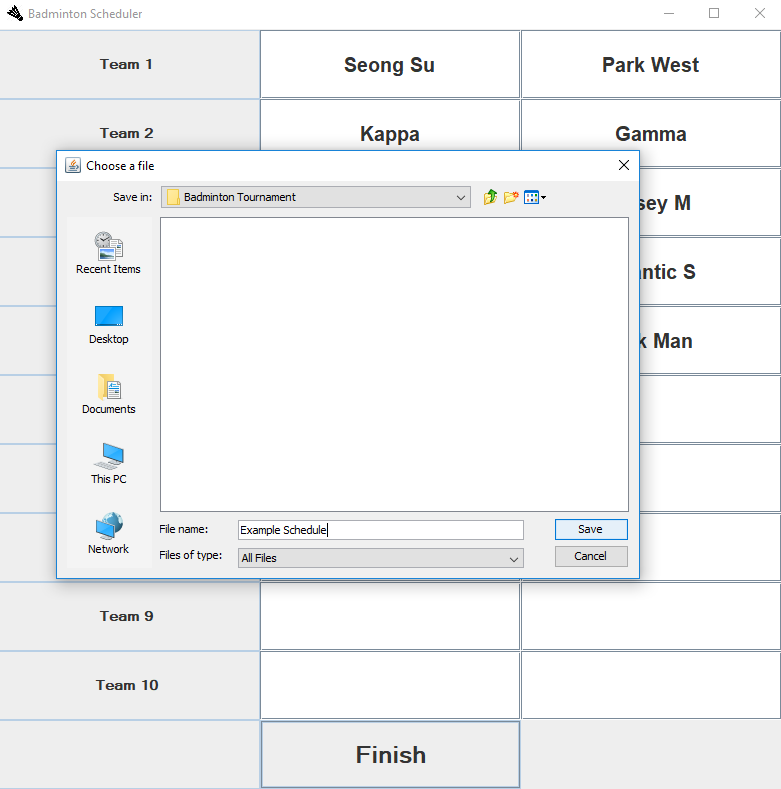
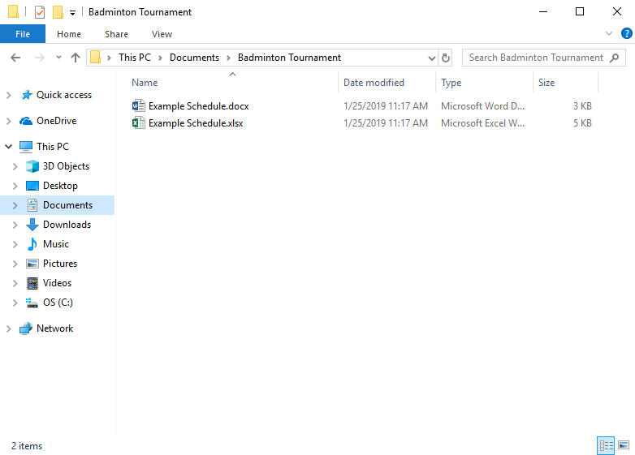
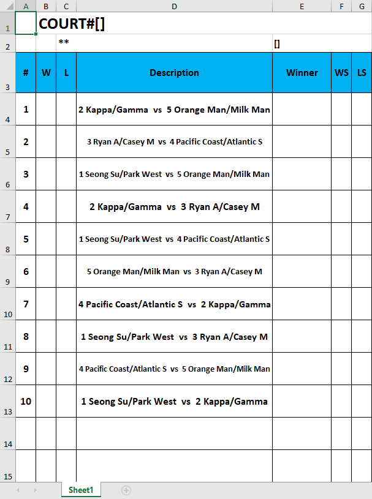
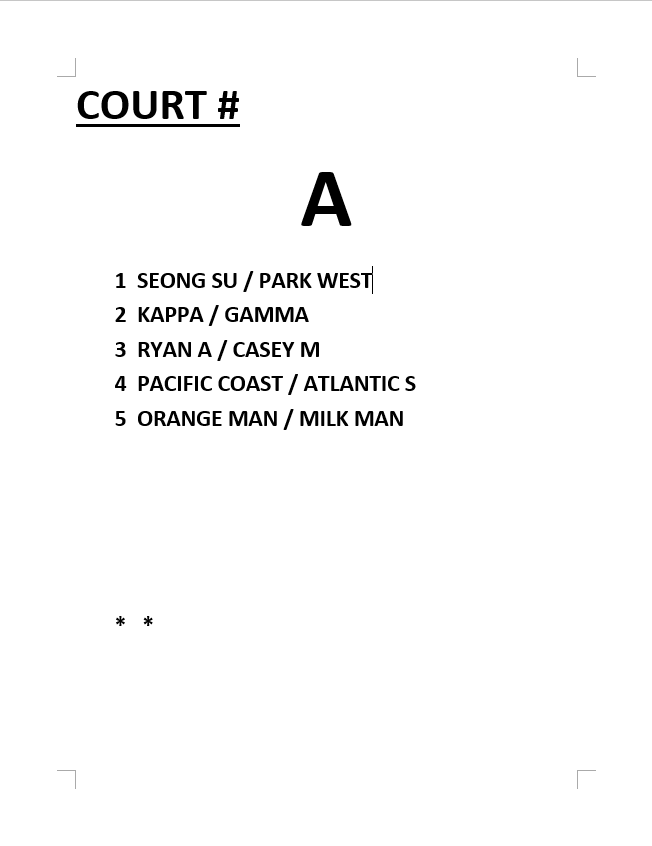

# Tournament Scheduler
Creates excel/word documents for single round robin badminton tournaments for up to 10 duo teams per court.
A scheduling algorithm makes the games equally spaced out so that the largest possible number of duos have equal resting times.           
200+ players compete in these tournaments which are hosted by KBFS America (http://kbfsa.com/).
I utilized the Apache POI API and Java Swing API for this project.

## Download

You can download the .exe file <a target="_blank" rel="noopener noreferrer" href="https://www.dropbox.com/s/wg1ci5rm8vxdj6q/Badminton%20Scheduler.exe?dl=0">here</a>.

## Screenshots

## Note

To properly print the excel file, change the format to A4.
